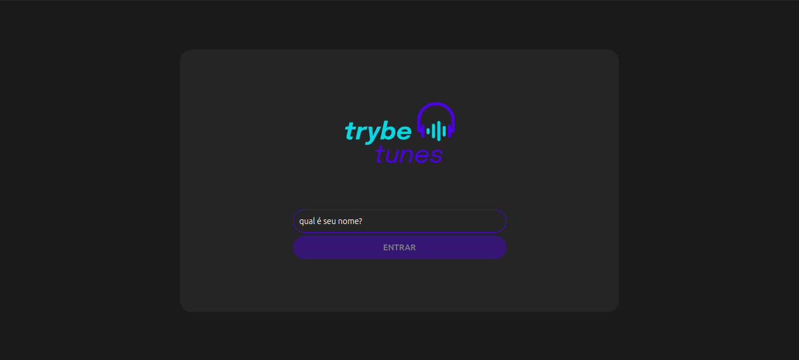
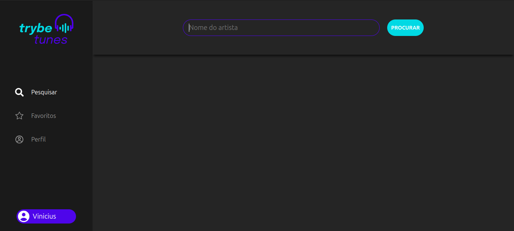
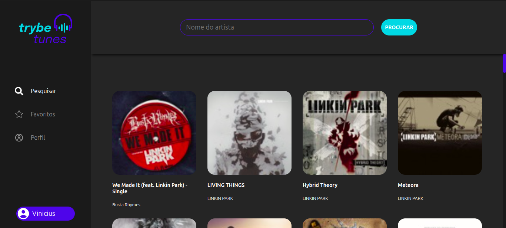
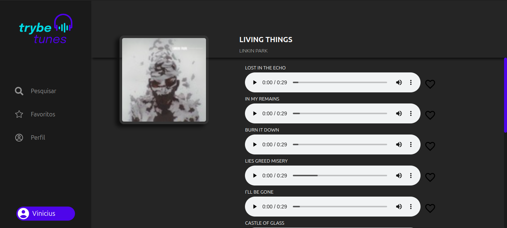
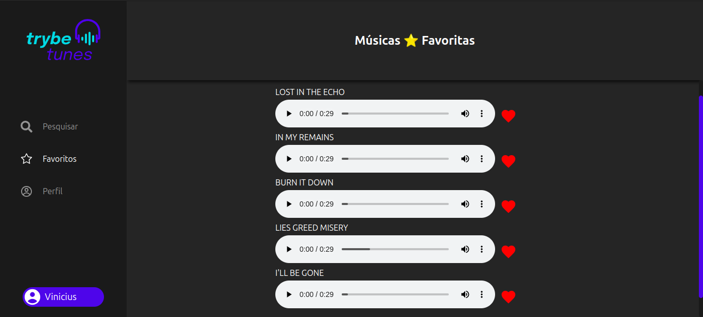
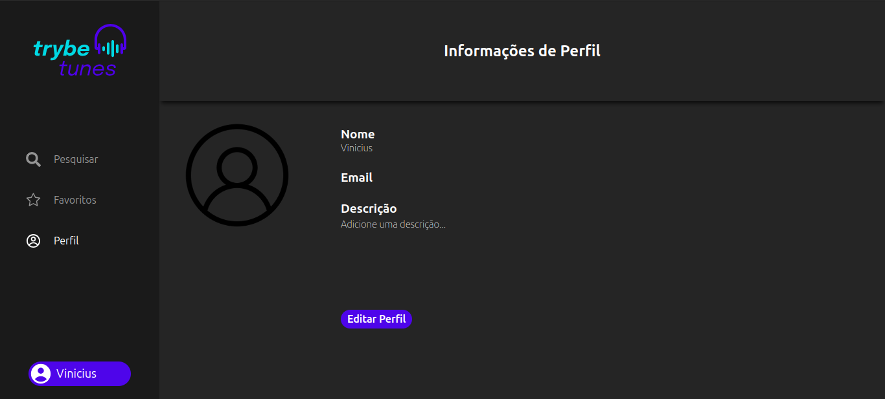
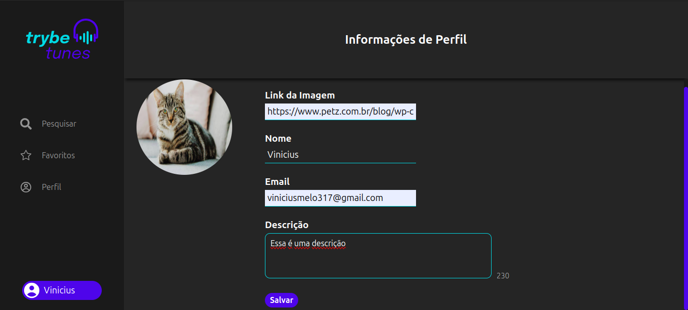
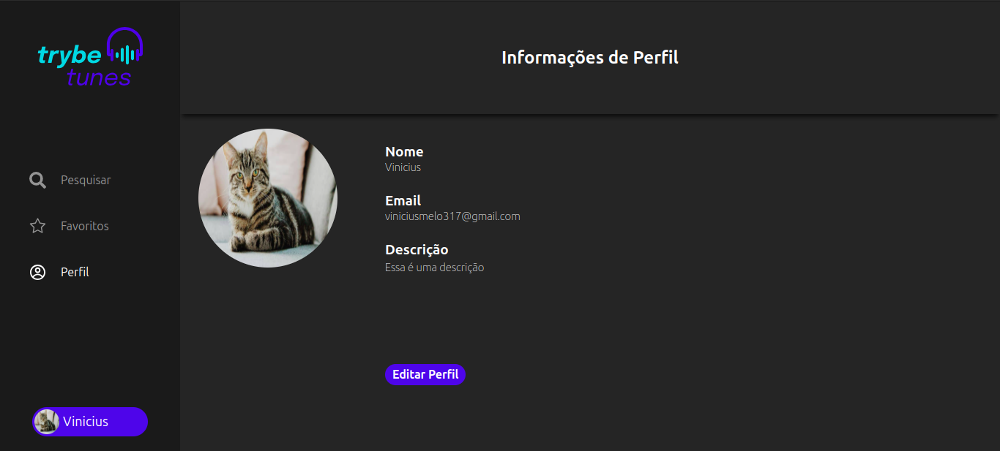

# Trybe Tunes 🎵

Este é um projeto proposto pela Trybe, onde o objetivo é fornecer à pessoa usuária um ambiente capaz de reproduzir músicas dos mais variados artistas e bandas, criar uma lista de músicas favoritas e editar o perfil da pessoa usuária logada.

## Deploy Link 🌐

### Acesse o deploy do meu projeto 👉 [Netlify](https://vmdtrybetunes.netlify.app/)

## Tabela de Conteúdos

- [Visão Geral](#overview)
  - [O desafio](#o-desafio)
  - [Screenshots](#screenshots)
- [Desenvolvimento](#desenvolvimento)
  - [Características Técnicas](#características-tecnicas)
- [Autor](#autor)

## Visão Geral 🔎

### O desafio

Funcionalidades para o usuário

- Simulação de login.
- Pesquisar por uma banda ou um artista.
- Listar os álbuns disponíveis dessa banda ou desse artista.
- Visualizar as músicas de um álbum selecionado.
- Reproduzir uma prévia das músicas do álbum.
- Favoritar e desfavoritar músicas.
- Ver a lista de músicas favoritadas.
- Ver o perfil da pessoa logada.
- Editar o perfil da pessoa logada.

## Screenshots 📷

### PC:

## Desenvolvimento

### Características Técnicas 🧑‍💻

- HTML5 Semântico
- CSS custom properties
- Styled components
- Flexbox
- [React.js](https://reactjs.org/)
- Typescript
- Gerenciamento de estado de componente
- Gerenciamento do Local Storage do navegador (escrita, leitura e remoção)
- Aplicação de regras de negócio
- Consumo da API do ITunes

## Autor

- Vinicius Melo: [LinkedIn](https://www.linkedin.com/in/vinicius-s-melo/)
